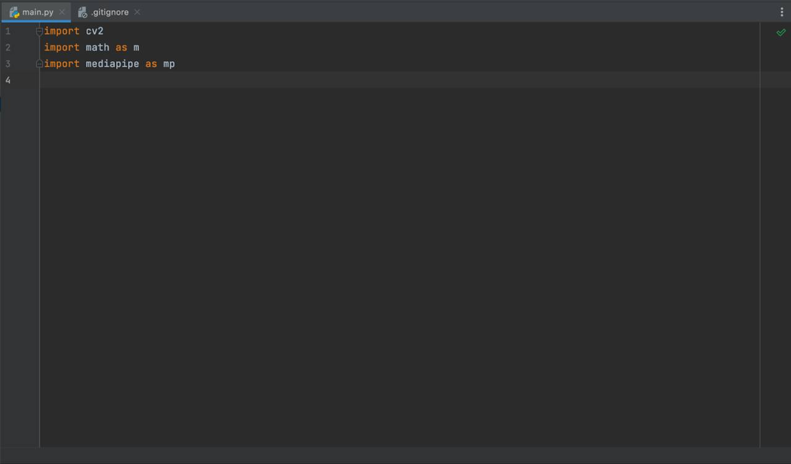
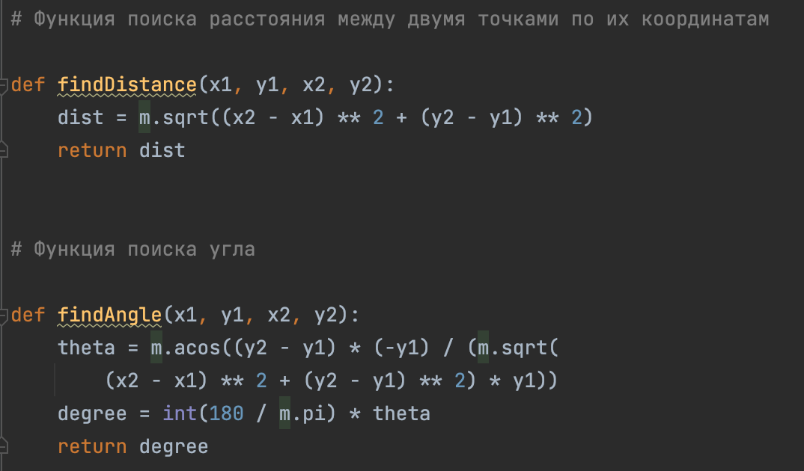
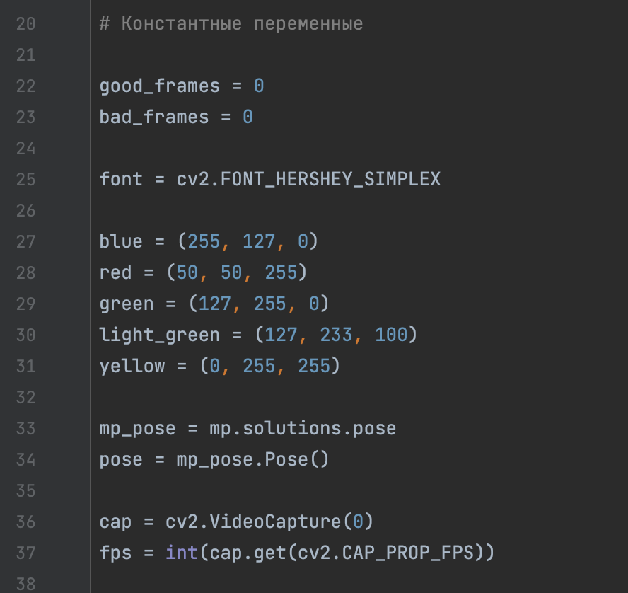
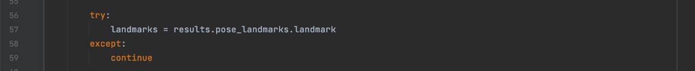
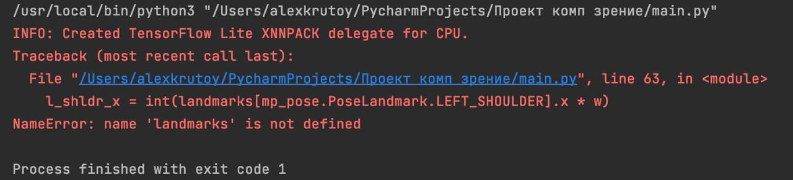
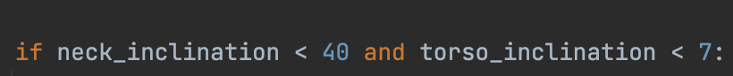
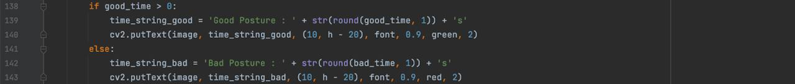

# Дневник проекта (Тырин Алексей)

Сама идея проекта (отслеживание осанки человека) пришла мне 26.12.22. Тогда же я начал работу над проектом.

Первым делом я подключил необходимые библиотеки, а так же я написал функции, которые я буду использовать в проекте.

Следующим делом я записал константные значения и объявил их в переменные. С этим никаких проблем не возникло.

Дальше начинается основной цикл. Я писал его на основе знаний, полученных на уроке + знаний, полученных с решений задач. Каждую строчку объяснять не вижу смысла, поэтому пройдусь по основным затруднениям, которые возникали на пути создания кода (все скрины ниже – куски готового кода):

 1. В этом участке кода программа пытается искать точки на теле
    человека. 
    
    Изначально, вместо continue я написал pass. Но в таком случае, если
    программа не видело точек (например камера была бы заслонена или
    человека не было бы в кадре) то она просто ломалась и выводила
    ошибку:
    
    Тогда, чтобы исправить эту проблему вместо pass я написал continue и
    программа стало работать корректно.

2.  В этом условном конструкторе мне пришлось потратить немало времени на подбор наиболее подходящих значений углов, чтобы программа работала наиболее точно, но в конечном итоге все получилось, я подобрал довольно правдоподобные знания
    

3. Так же, нужно было повозиться с координатами размещения текстов на экране, однако эта проблема тоже решилась временем.
   

	(строки 140, 143, третье значение в функции putText)